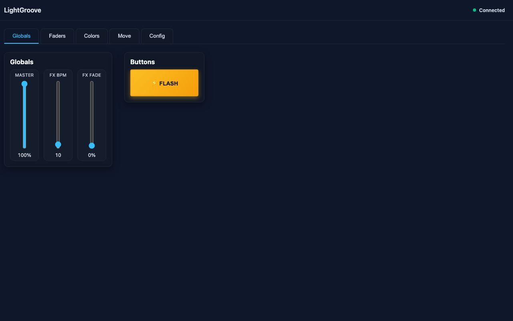
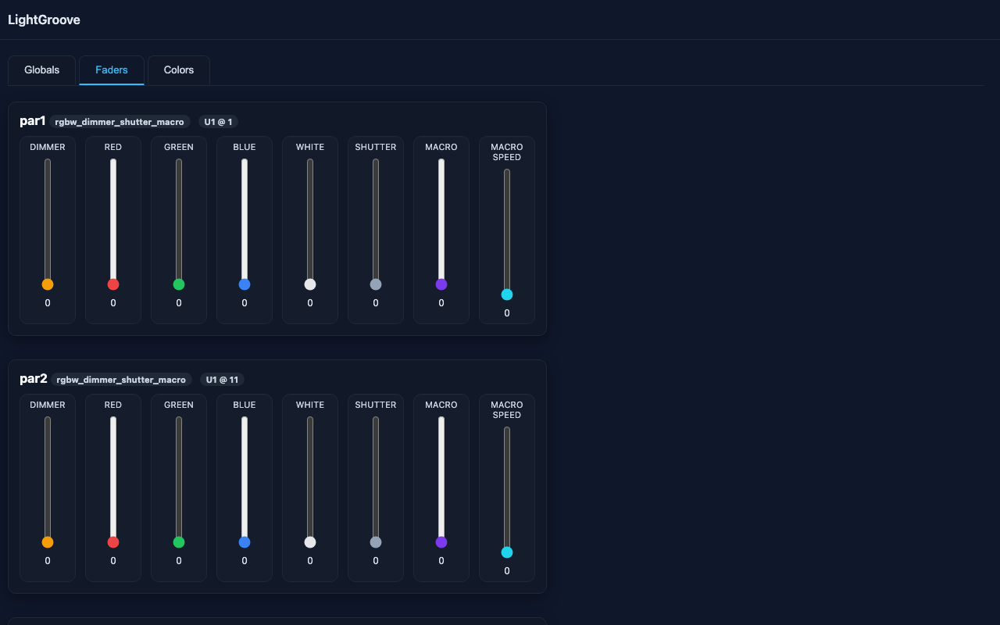
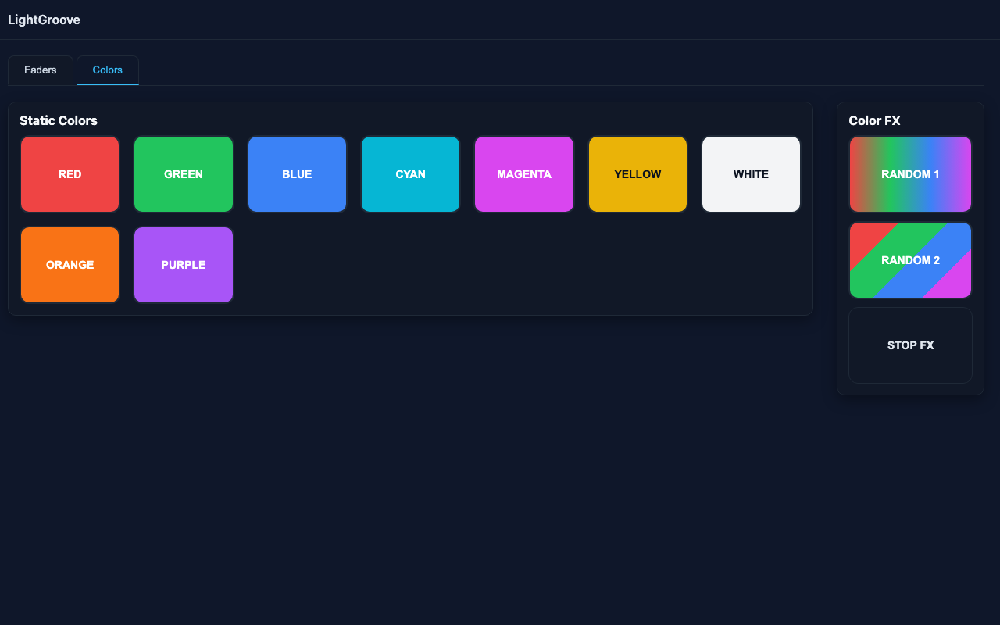

# LightGroove

**Free, Open Source DMX Lighting Controller - Community Powered**

Professional DMX lighting control made accessible for everyone. LightGroove is a modern, web-based lighting controller featuring real-time fader control, dynamic color effects, and intuitive web configuration. Built with Python and Flask, it provides professional-grade DMX control through ArtNet output with support for multiple universes and fixture types.

✨ **100% Free & Open Source** | 🤝 **Community Powered Development** | 💪 **Built by Lighting Enthusiasts**

🌐 **[Visit Website](https://oliverbyte.github.io/lightgroove/)** | 📖 **[Documentation](https://oliverbyte.github.io/lightgroove/docs)** | 💬 **[Discord Community](https://github.com/oliverbyte/lightgroove/discussions)**

## Perfect For

🎧 **Mobile DJs** - Lightweight, portable lighting control that runs on any device with a web browser. Set up your light show in minutes and control it from your laptop or tablet.

🏠 **Small Venues** - Professional-grade lighting control without the professional price tag. Perfect for bars, clubs, community theaters, and event spaces on a budget.

🔧 **Technology Enthusiasts** - Open source architecture you can customize and extend. Full access to the codebase means you can add features, create integrations, and learn how modern lighting control works.

## Why LightGroove?

- **💰 Completely Free** - No licensing fees, no subscriptions, no hidden costs
- **📖 Open Source** - MIT licensed, full source code access, modify as you need
- **🤝 Community Driven** - Development and support powered by the lighting community
- **🌐 Cross-Platform** - Runs on Windows, macOS, and Linux
- **🚀 Easy Setup** - Web-based interface accessible from any device on your network
- **⚡ No Compromise** - Professional features without the professional price

## Screenshots





## Features

### DMX / ArtNet Output
- **ArtNet Protocol Support** - Sends DMX data via ArtNet (monitor or ArtNet node required)
- **Universal Compatibility** - Works with any ArtNet-to-DMX interface (e.g., Enttec ODE, DMXking)
- **Multiple Universes** - Support for multiple DMX universes with independent control
- **Flexible Universe Mapping** - Configure universe mapping in web UI (e.g., DMX universe 1 → ArtNet universe 0)
- **Multi-Node Support** - Send to multiple ArtNet nodes simultaneously with different IP addresses

### Web-Based User Interface

**Globals Tab**:
- **Master Fader**: Global intensity control (0-100%) that scales all DMX output in real-time
  - Scales all fixtures without changing individual fader positions
  - Perfect for quick room brightness adjustments
- **FX BPM**: Control speed of color effects (1-480 BPM)
  - Synchronized timing for all color effects
  - Adjustable from slow ambient (1 BPM) to fast strobing (480 BPM)
- **FX Fade**: Smooth color transitions (0-100% of beat interval)
  - 0% = instant color changes
  - 100% = smooth fades over entire beat interval
  - Creates professional-looking transitions

**Buttons Section**:
- **Flash Button**: Press and hold for instant full white override
  - Automatically pauses any running color effects during flash
  - Instantly sets all fixtures to full white (via white channel only, RGB at 0)
  - Releases back to previous state (or blackout if no prior state)
  - Works at startup even without prior configuration
  - Touch-friendly for mobile devices
  - Perfect for attention-grabbing moments or emergency lighting

**Faders Tab**:
- **Compact Fixture Cards** - Clean, organized display of all patched fixtures
- **Vertical Faders** - Intuitive faders arranged in channel order
- **Real-time DMX Values** - Live display of DMX values (0-255) as you adjust
- **Responsive Layout** - Automatically adapts to screen width for optimal viewing on any device
- **Per-Fixture Control** - Independent control of every channel on every fixture
- **Channel Labels** - Clear channel names (Dimmer, Red, Green, Blue, White, etc.)

**Colors Tab**:
- **Static Colors**: 10 preset buttons with instant activation
  - Red, Green, Blue, Cyan, Magenta, Yellow, White, Orange, Purple, Black
  - Buttons dynamically display actual RGBW color from definitions
  - Colors fully customizable via Config tab
- **Color FX**: Server-side effects that run independently of the UI
  - **Random 1**: All fixtures display same color, cycles at BPM speed - unified color wash
  - **Random 2**: Each fixture gets different random color at each beat - disco ball effect
  - **Random 3**: Alternates between even/odd patches with black - strobe effect
  - **Random 4**: Chaser effect - one fixture at a time in sequence with random colors
  - Smooth fade transitions blend colors over the beat interval (adjustable via FX Fade)
  - Active effects automatically pause during flash button usage
- **Active Indication**: Visual feedback showing which color/effect is currently active
  - Single color highlighting for static colors and Random 1
  - Multi-color highlighting for Random 2/3/4 showing all active colors

**Config Tab** - Web-Based Configuration Editor:
- **ArtNet Nodes**: Manage output destinations
  - Add new ArtNet nodes with IP addresses and universe numbers
  - Edit existing node configurations
  - Delete nodes no longer in use
  - Support for multiple nodes on different network addresses
- **Universe Mapping**: Configure DMX to ArtNet universe routing
  - Map each DMX universe to specific ArtNet node and universe
  - Visual display of all universe mappings
  - Easy reconfiguration without editing JSON files
- **Colors**: Full color management system
  - Edit RGBW color definitions (0-1 range) with interactive sliders
  - Live color preview showing actual color before saving
  - Add custom colors with any name
  - Remove colors you don't need
  - Changes immediately reflected in Colors tab buttons
- **Global Settings**: System-wide configuration
  - Configure default output mode (ArtNet/virtual DMX)
  - Set output frame rate (FPS) for timing control
  - Adjust performance settings
- **Automatic Reload**: All configuration changes save immediately and reload the server automatically
  - No manual restart required
  - Seamless updates without interrupting your workflow

### Connection Monitoring & Recovery
- **Real-Time Status Indicator** - Visual connection status in header
  - Green dot = connected and operational
  - Red pulsing dot = server offline or connection lost
- **Automatic Recovery** - Seamless reconnection handling
  - UI automatically detects when server comes back online
  - Reloads all data and continues operation without manual intervention
  - No need to refresh browser or restart application
- **Zero Downtime** - Continue working during configuration changes
  - Server reloads don't require UI refresh
  - All settings preserved during reload

## Installation

### Windows Installer (Recommended)
Download the latest `LightGrooveSetup.exe` from the [Releases](https://github.com/oliverbyte/lightgroove/releases) page. 

**What you get:**
- Simple one-click installation
- Desktop shortcut for easy access
- Start Menu integration
- Automatic dependency management
- Auto-opens web UI at http://localhost:5555

The installer is automatically built and published whenever changes are pushed to the main branch, ensuring you always have access to the latest version.

**To install:**
1. Download `LightGrooveSetup.exe` from [Releases](https://github.com/oliverbyte/lightgroove/releases)
2. Run the installer
3. Launch LightGroove from the Start Menu or Desktop shortcut
4. The web UI will automatically open in your default browser

### macOS via Homebrew
Quick installation using Homebrew package manager:

```bash
# Add the LightGroove tap
brew tap oliverbyte/lightgroove https://github.com/oliverbyte/lightgroove.git

# Install LightGroove
brew install --HEAD oliverbyte/lightgroove/lightgroove

# Run LightGroove
lightgroove
```

The web UI will open automatically at http://localhost:5555

### Linux / From Source
Perfect for developers, contributors, or Linux users:

**Requirements:**
- Python 3.9 or higher
- pip (Python package manager)
- virtualenv (recommended for isolation)

**Installation steps:**

```bash
# Clone the repository
git clone https://github.com/oliverbyte/lightgroove.git
cd lightgroove

# Create and activate virtual environment (recommended)
python3 -m venv .venv
source .venv/bin/activate  # On Windows: .venv\Scripts\activate

# Install dependencies
pip install -r requirements.txt

# Run LightGroove
python main.py
```

Then open http://localhost:5555 in your browser.

### First Time Setup

After installation:

1. **Open the web UI** - Navigate to http://localhost:5555
2. **Configure ArtNet** - Go to the Config tab to set up your ArtNet nodes
3. **Define Fixtures** - Edit `config/fixtures.json` to add your fixture profiles
4. **Patch Fixtures** - Edit `config/patch.json` to assign fixtures to DMX addresses
5. **Customize Colors** - Use the Config tab to add or modify color presets
6. **Start Controlling** - Switch to the Faders or Colors tab and start creating your light show!

**Pro Tip:** The Config tab allows you to manage ArtNet nodes and colors directly from the web UI without manually editing JSON files.
python -m venv .venv
source .venv/bin/activate
pip install -r requirements.txt
python main.py
```

Then open http://localhost:5555 in your browser.

## Configuration

LightGroove uses JSON configuration files for fixtures, patching, ArtNet, and colors. Most configuration can be managed through the **Config tab** in the web UI for easy editing without touching files.

### Configuration Files

- **`config/fixtures.json`**: Fixture profiles with channel definitions
  - Define fixture types with their channel layouts
  - Specify channel names, types, and defaults
  - Supports RGBW, RGB, dimmer-only, and custom channel configurations
  
- **`config/patch.json`**: Patched fixtures per universe with DMX addresses
  - Assign fixtures to specific DMX addresses
  - Organize fixtures across multiple universes
  - Set per-fixture identifiers for easy management
  
- **`config/artnet.json`**: ArtNet targets and universe mapping
  - Configure ArtNet node IP addresses and universes
  - Map DMX universes to ArtNet nodes
  - **Can be edited via Config tab** in the web UI
  
- **`config/colors.json`**: Color definitions for static colors and FX
  - Define RGBW values (0.0-1.0 range) for each color
  - Create custom color presets
  - **Can be edited via Config tab** in the web UI with live preview

### Web UI Configuration (Recommended)

The **Config tab** provides a user-friendly interface for managing:

- **ArtNet Nodes** - Add, edit, or delete output destinations without editing JSON
- **Universe Mapping** - Configure which DMX universe goes to which ArtNet node
- **Colors** - Create and edit colors with RGBW sliders and live preview
- **Global Settings** - Adjust output mode and FPS

**All changes are saved immediately** and the server reloads automatically - no manual restart needed!

### Manual Configuration

For advanced users or automation, you can directly edit the JSON files. The server will detect changes and reload automatically when configuration files are modified.

## Changelog

### January 2026
- **Web-Based Configuration**: Complete configuration editor accessible through the Config tab
  - Add, edit, and delete ArtNet nodes with IP addresses and universes
  - Configure universe mapping between DMX universes and ArtNet nodes
  - Edit color definitions with RGBW sliders and live preview
  - Add or remove custom colors
  - Configure global settings (output mode, FPS)
  - All changes save immediately with automatic server reload
- **Enhanced Color System**:
  - Dynamic color buttons automatically display actual RGBW values from `colors.json`
  - Active color indication - buttons highlight to show what's currently active
  - Multi-color highlighting support for Random 2/3/4 effects showing all active colors
  - Color editor with live preview for creating and modifying colors
- **Advanced Color Effects**:
  - Random 4 FX: Sequential chaser effect lighting one fixture at a time with random colors
  - Random 3 FX: Alternating even/odd patch strobe effect
  - Random 2 FX: Each fixture displays different random colors simultaneously
  - Random 1 FX: All fixtures display the same color, cycling through random colors
  - Server-side effects engine with BPM synchronization (1-480 BPM)
  - Adjustable fade control (0-100%) for smooth color transitions
- **Connection Resilience**:
  - Real-time connection status indicator in header
  - Automatic UI recovery when server reconnects
  - Seamless continuation of operations after connection restore
- **Flash Button Enhancement**:
  - Press and hold for instant full white override
  - Automatically pauses running color effects during flash
  - Works at startup even without prior configuration
  - Touch-friendly for mobile devices
- **Real-Time Fader Control**:
  - Per-fixture channel control with live DMX value display (0-255)
  - Compact fixture cards with vertical faders
  - Responsive layout adapting to screen width
- **ArtNet Output**: Professional DMX output via ArtNet with universe mapping and multi-node support

### Planned Features
- MIDI controller support for physical control surfaces
- Scene presets and cue lists
- Timeline-based programming
- Audio reactive effects
- Additional fixture profiles

## Contributing

We welcome contributions from the community! Whether you're fixing bugs, adding features, improving documentation, or helping other users, your contributions make LightGroove better.

For development setup, architecture details, and contribution guidelines, see [DEVELOPMENT.md](DEVELOPMENT.md).

**Ways to Contribute:**
- 🐛 Report bugs and issues
- 💡 Suggest new features
- 📝 Improve documentation
- 🔧 Submit pull requests
- 💬 Help other users in discussions
- ⭐ Star the project on GitHub

Join our community on [GitHub Discussions](https://github.com/oliverbyte/lightgroove/discussions) to ask questions, share your setups, and connect with other users!

